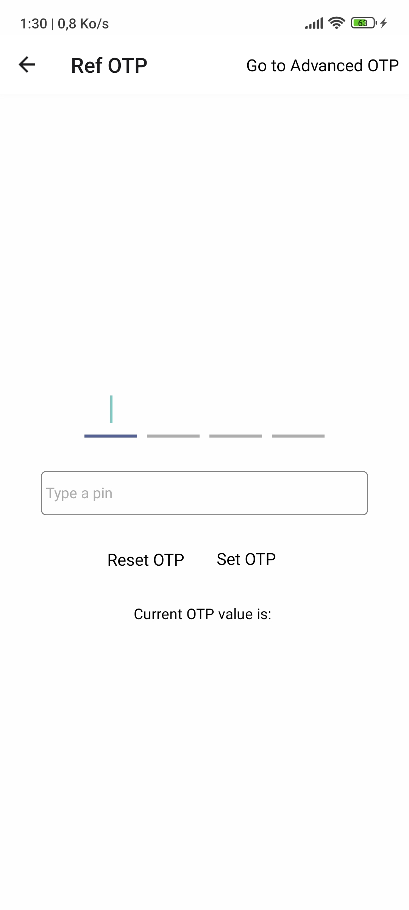
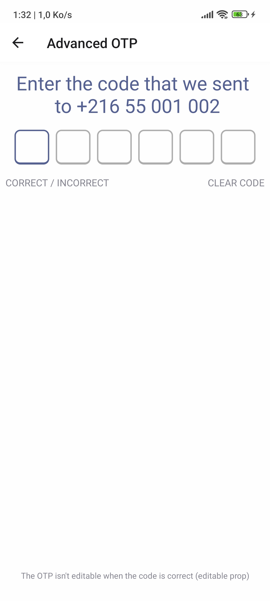

# OTP Text Input

An elegant and highly customizable One-Time Password (OTP) input library designed to simplify the implementation and enhance the user experience of OTP authentication flows in React Native Applications.

* Written in TypeScript.
* Supports Android / iOS / Web.
* Highly customizable.
* Easy to use.
* Lightweight.
* Fully responsive.
* Supports RTL.
* Supports Dark Mode.
* Supports custom styles.
* Supports custom keyboard types.


## Screenshots

These screenshots show the OTP Text Input in action, with different styles and configurations. taken from the example project below.

<div style="text-align: left; flex-direction: row">




</div>


## Installation

```sh
npm install @sectiontn/otp-input
```
OR
```sh
yarn add @sectiontn/otp-input
```

## Imports

Import the `OTP` component from the `@sectiontn/otp-input` package and use it in your React Native application.

```typescript jsx
import { OTPTextInput } from '@sectiontn/otp-input';
```

You may need to import type `OTPTextViewHandle` to use the `ref` on the component (if you use TypeScript).

```typescript jsx
import { OTPTextInput, type OTPTextViewHandle } from '@sectiontn/otp-input';
```
## Usage
Call the `OTPTextInput` component in your JSX code and pass the required props to customize the OTP input field.

```typescript jsx
import { Platform } from 'react-native';

<OTPTextInput
  inputCount={4}
  tintColor={"#FF6F61"}
  offTintColor={"#BBBCBE"}
  onTextChangeHandler={(pin: string) => {
    console.log('Current OTP:', pin);
  }}
  keyboardType={Platform.OS === 'ios' ? 'number-pad' : 'numeric'}
/>
```

## Example

Full Example: Check the example at [OTP Input Example](https://github.com/SectionTN/otp-input-example) made with react-native-cli.
<br>
<br>
Advanced Usage: [Expo Snack Demo](https://snack.expo.dev/@sectiontn/otptextinput-advanced-example)

## Contributing

See the [contributing guide](CONTRIBUTING.md) to learn how to contribute to the repository and the development workflow.

## License [GPLv3 license](./LICENSE).

    Copyright (C) 2024 Mohamed Rayen Sbai

    This program is free software: you can redistribute it and/or modify
    it under the terms of the GNU General Public License as published by
    the Free Software Foundation, either version 3 of the License, or
    (at your option) any later version.

    This program is distributed in the hope that it will be useful,
    but WITHOUT ANY WARRANTY; without even the implied warranty of
    MERCHANTABILITY or FITNESS FOR A PARTICULAR PURPOSE.  See the
    GNU General Public License for more details.

    You should have received a copy of the GNU General Public License
    along with this program.  If not, see <https://www.gnu.org/licenses/>.

Made with [create-react-native-library](https://github.com/callstack/react-native-builder-bob)
